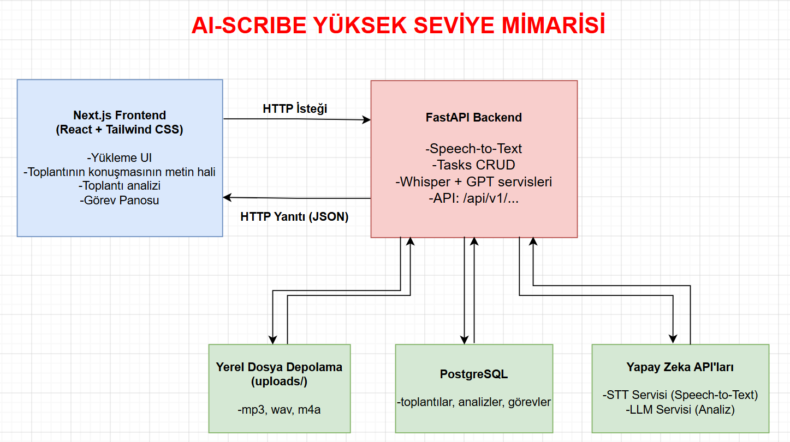

# AI-SCRIBE — Teknoloji ve Mimari

## 1. Proje Genel Tanımı ve Amacı

AI-SCRIBE; müşteri ile yapılan ilk toplantıların ses veya video kayıtlarını sisteme aktararak Speech-to-Text (ses analizi), doğal dil işleme (NLP) ve yapay zekâ teknolojileri yardımıyla toplantılardan otomatik özet, kararlar ve yapılacak iş listesi çıkaran akıllı bir asistan platformudur.

## 2. Teknoloji Yığını

| Katman | Teknoloji |
|--------|-----------|
| Frontend | React, Next.js, Tailwind CSS |
| Backend | Python FastAPI |
| Veritabanı | PostgreSQL |
| Dosya depolama | Yerel depolama (`backend/uploads/`) |
| AI entegrasyonu | OpenAI Whisper + GPT-4o-mini |

## 3. Yüksek Seviye Mimari

*Şekil 1. AI-SCRIBE Yüksek Seviye Mimarisi*

## 4. İş Akışı

1. Kullanıcı ses dosyasını uygulamaya yükler.
2. Frontend, ses dosyasını FastAPI backend’e gönderir.
3. Backend, ses dosyasını yerel `uploads/` klasörüne kaydeder ve toplantı kaydı oluşturur.
4. Backend, kaydedilen ses dosyasını harici STT servisinin API’sine gönderir.
5. STT servisi, sesi yazıya çevirerek transkripti backend’e döndürür.
6. Backend, transkripti PostgreSQL veritabanına kaydeder.
7. Backend, transkripti analiz edilmesi için LLM servisinin API’sine gönderir.
8. LLM servisi; toplantı özetini, alınan kararları ve aksiyon maddelerini backend’e döndürür.
9. Backend, analiz sonuçlarını ve oluşturulan görevleri PostgreSQL veritabanına kaydeder.
10. Frontend, sonuçları backend API’sinden alarak kullanıcıya gösterir.

## 5. Backend Modüler Yapısı

- **API modülü (`api/`):** Frontend’den gelen HTTP isteklerini karşılar, ilgili servisi çalıştırır ve sonucu kullanıcıya döndürür.
- **Transkripsiyon servisi (`services/transcription.py`):** Ses dosyasını STT servisine gönderir ve konuşmanın yazılı hâlini alır.
- **Analiz servisi (`services/analysis.py`):** Transkripti LLM servisine göndererek toplantı özeti, alınan kararlar ve aksiyon maddelerini oluşturur.
- **Dosya depolama servisi (`services/storage.py`):** Yüklenen ses dosyalarının yerel `uploads/` klasörüne kaydedilmesini ve buradan okunmasını sağlar.
- **Repository modülü (`repositories/`):** PostgreSQL veritabanına veri ekleme, görüntüleme, güncelleme ve silme işlemlerini gerçekleştirir.
- **Schema modülü (`schemas/`):** API’ye gelen ve API’den gönderilen verilerin yapısını tanımlar ve doğrular.
- **Model modülü (`models/`):** PostgreSQL veritabanındaki tabloların Python tarafındaki karşılıklarını tanımlar. Toplantı, transkript, analiz ve görev modelleri bu bölümde yer alır.
