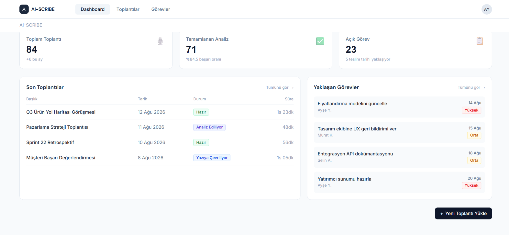
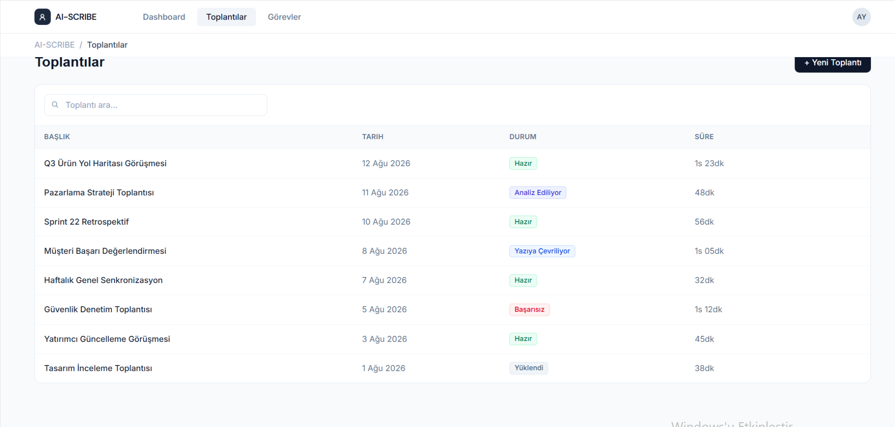
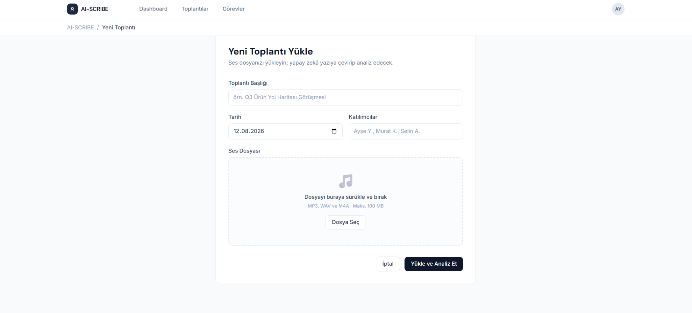
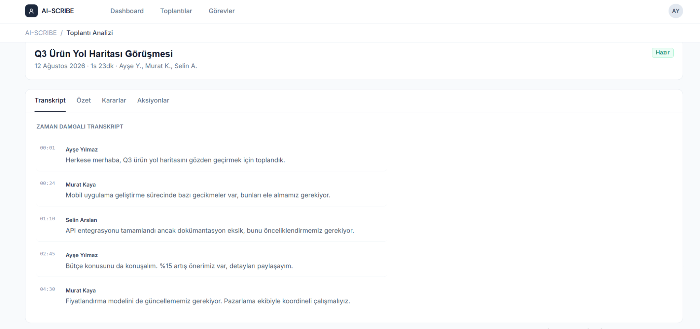
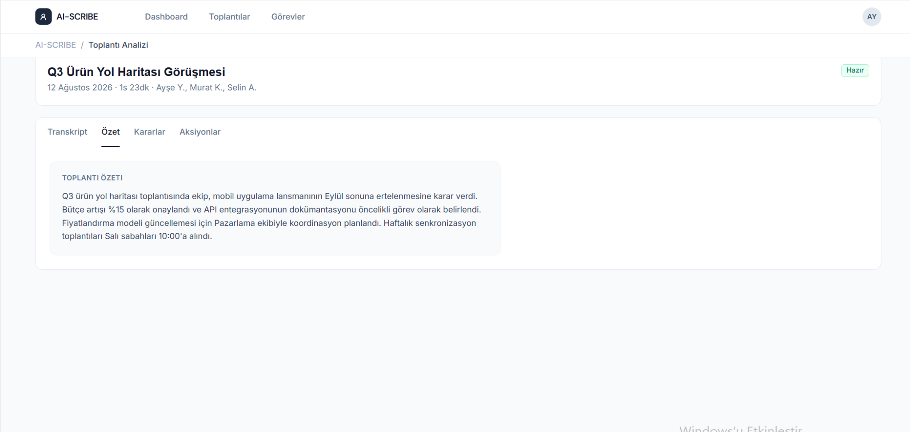
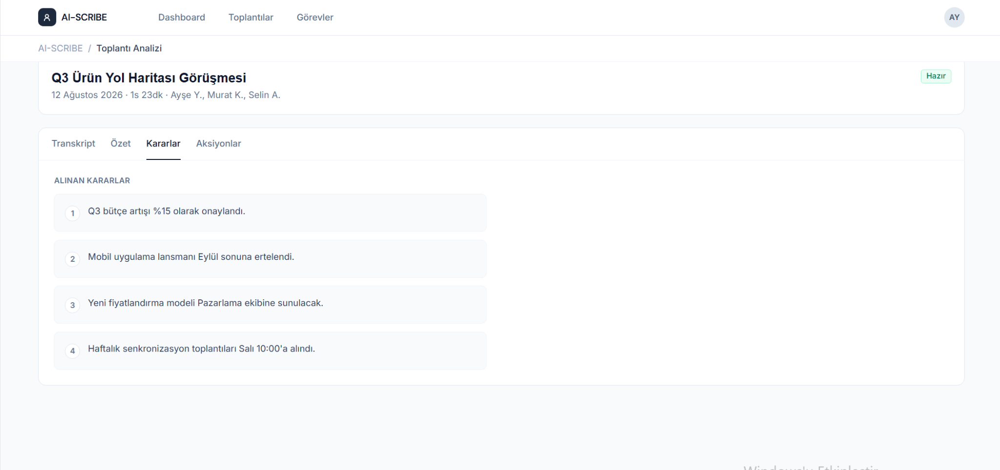
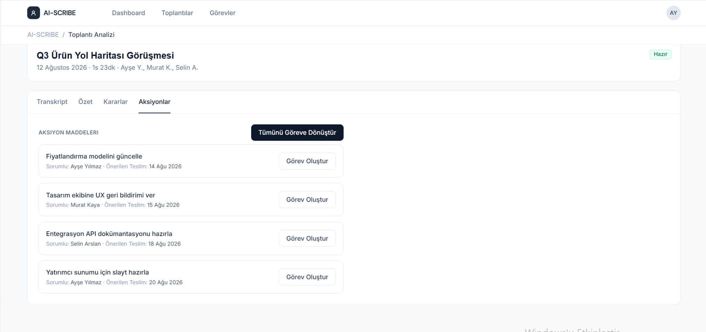
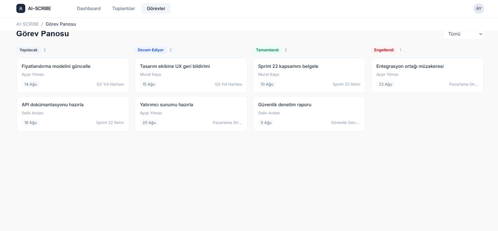
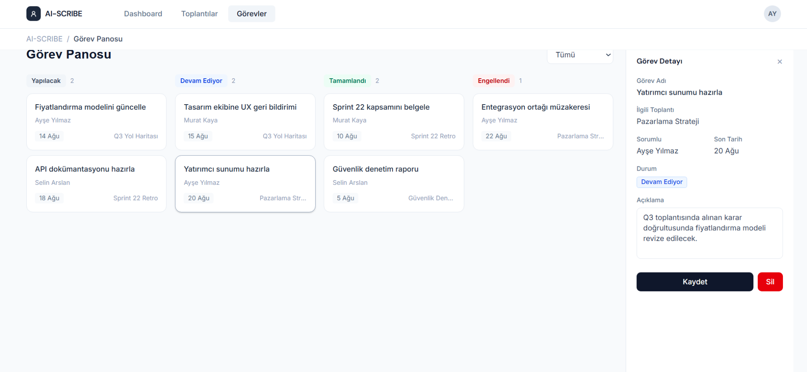

# AI-SCRIBE — Arayüz Mockup’ları

Bu doküman, AI-SCRIBE uygulaması için hazırlanan temel ekran tasarımlarını gösterir.

## 1. Dashboard

*Şekil 2. AI-SCRIBE Dashboard Ekranı*

## 2. Toplantı Listesi

*Şekil 3. Toplantı Listesi Ekranı*

## 3. Yeni Toplantı ve Ses Dosyası Yükleme

*Şekil 4. Yeni Toplantı ve Ses Dosyası Yükleme Ekranı*

## 4. Toplantı Transkripti

*Şekil 5. Toplantı Transkript Ekranı*

## 5. Toplantı Özeti

*Şekil 6. Toplantı Özet Ekranı*

## 6. Alınan Kararlar

*Şekil 7. Alınan Kararlar Ekranı*

## 7. Aksiyon Maddeleri ve Görev Oluşturma

*Şekil 8. Aksiyon Maddeleri ve Görev Oluşturma Ekranı*

## 8. Görev Takip Panosu

*Şekil 9. Görev Takip Panosu*

## 9. Görev Detayı

*Şekil 10. Görev Detay Paneli*

## Ekran ve Rota Eşlemesi

| Ekran | Next.js rotası |
|-------|----------------|
| Dashboard | `/` |
| Toplantı listesi | `/meetings` |
| Yeni toplantı | `/meetings/new` |
| Toplantı analizi | `/meetings/[id]` |
| Görev panosu | `/tasks` |
